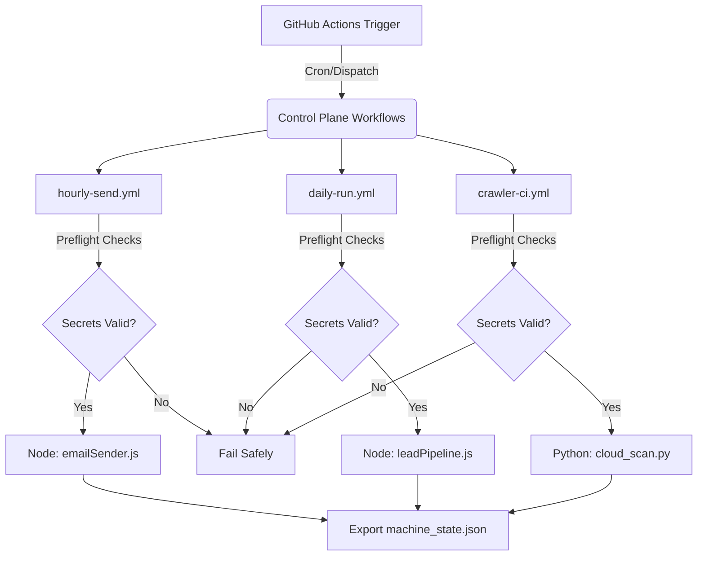

# MBM Control Tower - Architecture & Playbook

This document defines the standard operating procedures, architectural maps, and recovery playbooks for the MBM automation stack. It is designed to be federated across other repositories to maintain operational consistency for both human and AI agent operators.

## 1. Workflow Architecture Map

The repository is driven by GitHub Actions workflows acting as the primary control plane.

## 2. Safe-State Operations (DRY_RUN vs ARMED)

All scheduled automation workflows support two states:
- **DRY_RUN (Safe)**: The default state for manual triggers (`workflow_dispatch`). No destructive actions (e.g., sending emails, mutating production leads) will occur.
- **ARMED (Live)**: The state used during scheduled cron runs or explicitly overridden manual runs.

## 3. Failure Triage Checklist

When a workflow fails, operators (Human or AI) should follow this checklist:

1. **Check the Step Summary**: Navigate to the workflow run in GitHub Actions. The `$GITHUB_STEP_SUMMARY` will indicate if the failure occurred at the Preflight Gate (missing secrets) or during Execution.
2. **Download `machine_state.json`**: Inspect the artifact generated by the run to view the exact timestamp and mode.
3. **Verify API Rate Limits**: If a service (e.g., Supabase, SMTP) returns HTTP 429, back off and ensure duplicate suppression logic prevents retries from sending duplicate emails.
4. **Run in DRY_RUN Mode**: Manually trigger the workflow with `DRY_RUN=true` to test the fix without affecting production.

## 4. Recovery & Rollback Playbook

In the event of corrupted machine state or a destructive run:

### State Rollback
1. Identify the timestamp of the bad run via `machine_state.json`.
2. Connect to the Supabase database.
3. If leads were incorrectly marked as processed, run an explicit SQL `UPDATE` to revert their `status` to `pending` where `updated_at > [timestamp]`.

### Workflow Suspension
If a script begins failing consistently due to upstream changes:
1. Disable the specific GitHub Action workflow from the Actions tab.
2. DO NOT delete the workflow file; instead, keep it disabled until patched.
3. Run `health-report.yml` manually to log the degradation in Repo Health Score.

## 5. Cross-Repo Federation Standards

When applying this Control Tower architecture to new repositories, enforce these rules:
- **Standardized Preflight**: Every workflow modifying data MUST check for required secrets explicitly.
- **Artifact Logging**: Output `machine_state.json` as an artifact on failure AND success.
- **Modularity**: Never bundle multiple distinct scripts into a single `schedule.yml`. Separate them by domain (e.g., `crawler-ci.yml`, `daily-run.yml`).
