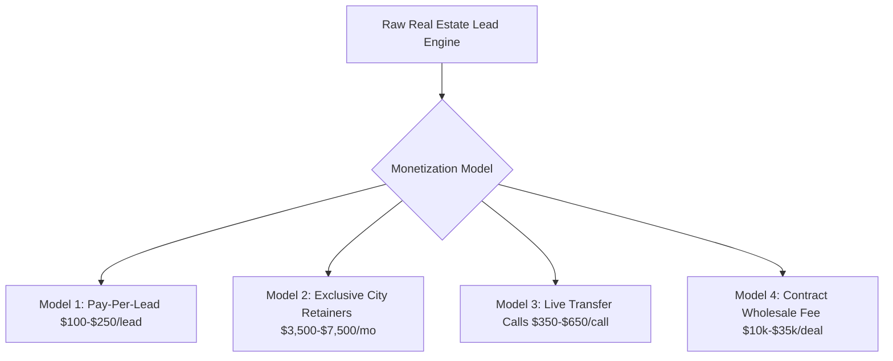

# 💎 High-Ticket Real Estate Lead Monetization Playbook
## How to Sell High-Intent Off-Market Real Estate Leads for $2,500 – $10,000/mo Retainers

---

## 🏛️ 1. The 4 Proven Monetization Models



### Model 1: Pay-Per-Lead (PPL) — $100 to $250 per Verified Lead
* **Target Buyer**: Active local fix-and-flippers, mid-size wholesalers, and boutique investors.
* **Packaging**: Sold in monthly packs of 25, 50, or 100 verified leads ($2,500 to $10,000/pack).
* **The Guarantee**: Zero 555 numbers, 100% verified cell phones with county deed matching.

### Model 2: Exclusive Territory Retainers — $3,500 to $7,500 / Month
* **Target Buyer**: Top 1% Real Estate Agent Teams, Private Equity Acquisitions Funds, Multi-Family Syndicators.
* **Pitch**: *"We become your exclusive off-market acquisitions desk in Dallas/Miami/Atlanta. You receive 100% of all off-market seller leads in your zip codes before anyone else sees them."*

### Model 3: Live Transfers & Booked Appointments — $350 to $650 per Qualified Call
* **Target Buyer**: Institutional buyers with active sales teams who don't want raw data.
* **Mechanism**: When our dialer connects with a seller who confirms asking price and timeline, the call is transferred directly to the buyer's acquisitions specialist.

### Model 4: Deal Wholesaling / Joint Venture Assignment — $10,000 to $35,000 per Closed Deal
* **Target Buyer**: Cash Buyers & Hedge Funds on our VIP list.
* **Mechanism**: We lock up the motivated seller under contract at $0.60 on the dollar, then assign the purchase agreement to our cash buyer for an assignment spread.

---

## ✨ 2. What Makes a Lead Look "Ultra-Fancy & Institutional"

Amateur lead generators send messy Google Sheets with disconnected numbers. 
**Institutional Buyers pay top dollar for Goldman Sachs / Bloomberg-grade Deal Dossiers.**

### The 5 Hallmarks of Ultra-Luxury Lead Packaging:
1. **Verified Underwriting Matrix**:
   - After Repair Value (ARV) backed by 3 recent MLS comps within 0.5 miles.
   - Itemized Rehab Budget Estimate (Roof, HVAC, Cosmetic, Foundation).
   - Maximum Allowable Offer (MAO) calculated using the institutional 70% rule.
2. **Multi-Vector Motivation Scoring**:
   - Documented distress triggers: Absentee out-of-state owner, tax delinquency, code violations, probate status.
3. **Deed & Telecom Security Seal**:
   - Direct matching between County Tax Assessor records and 3-bureau telecom carrier lines.
4. **Interactive Deal Room Terminal**:
   - Clients log into a sleek, dark-mode terminal ([`luxury_deal_terminal.html`](file:///c:/Users/omare/OneDrive/Desktop/AI/MBM/LeadEngine/InstitutionalRealEstate/luxury_deal_terminal.html)) with 1-click contract reservations and live spread calculators.

---

## 📞 3. Word-for-Word Pitch to Real Estate Buyers & Funds

```text
"Hi [Name], Omar here with MBM Capital Off-Market Deal Desk.

We run an institutional pre-acquisition engine tracking off-market residential and commercial value-add assets across [City]. 

Unlike raw scraping lists that are filled with disconnected numbers, every single asset in our terminal is underwritten with verified ARV comps, rehab estimates, and direct verified owner contacts with >40% equity.

We are currently onboarding 2 preferred cash buyers for our Q3 exclusive off-market deal feed. 

Would you be open to taking a look at our live terminal and 3 sample deal dossiers this week?"
```

---

## 🚀 4. Live Assets Ready in Workspace
- **Luxury Deal Terminal UI**: [`luxury_deal_terminal.html`](file:///c:/Users/omare/OneDrive/Desktop/AI/MBM/LeadEngine/InstitutionalRealEstate/luxury_deal_terminal.html)
- **Institutional Dossier Engine**: [`institutional_lead_dossier_engine.py`](file:///c:/Users/omare/OneDrive/Desktop/AI/MBM/LeadEngine/InstitutionalRealEstate/institutional_lead_dossier_engine.py)
- **Sample Institutional JSON Feed**: [`institutional_deal_dossiers.json`](file:///c:/Users/omare/OneDrive/Desktop/AI/MBM/LeadEngine/InstitutionalRealEstate/dossiers/institutional_deal_dossiers.json)
