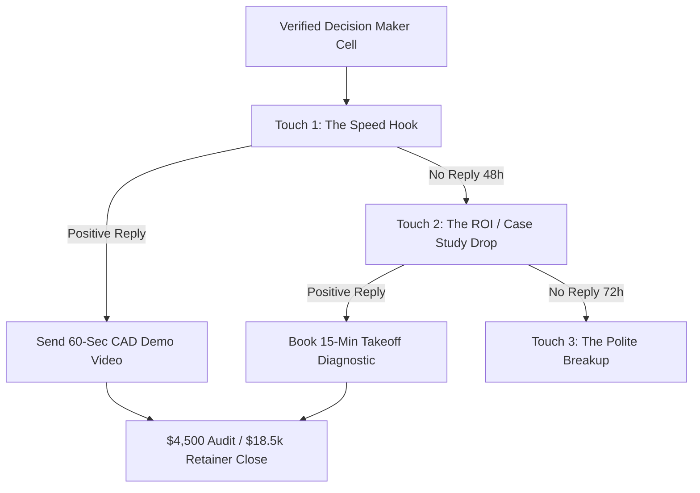

# 📱 Phound App & Native SMS AI Consultancy Acquisition Playbook

> **Zero Twilio Lock-in** • **100% Native Phound & Carrier Protocol** • **Enterprise High-Ticket ConTech AI Clients**

---

## 🎯 1. The 3-Touch High-Converting B2B SMS Cadence



### 📩 Touch 1: The Speed Hook (First Contact)
```text
"Hi [First Name], Omar here from ConTech AI. We built an autonomous CAD-to-BOQ pipeline for civil & structural engineering firms that cuts 3-week manual takeoffs down to 10 mins with zero math errors. We are doing 3 complimentary benchmark audits for contractors in [City] this month. Open to seeing a 60-sec demo on 1 sample drawing?"
```

### 📩 Touch 2: The ROI & Case Study Drop (+48 Hours)
```text
"Hey [First Name], quick follow up—we just helped a structural engineering team cut bid prep time by 78% while doubling their tender volume. Would love to send over the 1-page case breakdown. What is the best email for your estimating lead?"
```

### 📩 Touch 3: The Polite Breakup (+72 Hours)
```text
"Hey [First Name], assuming your estimating team is fully set on bandwidth right now. If takeoff bottlenecks ever slow down bid submissions, keep my cell handy. Best of luck on your active bids, Omar."
```

---

## ⚡ 2. How to Use with Phound App & Native Mobile SMS

1. **Open the Visual Cockpit**:
   [`phound_sms_cockpit.html`](file:///c:/Users/omare/OneDrive/Desktop/AI/MBM/Phound/phound_sms_cockpit.html)
2. **1-Click Actions**:
   - **`Open in Phound App`**: Opens `https://web.phound.app/?phone=...&message=...` with the prospect and message pre-populated in your Phound business number.
   - **`Native SMS`**: Opens your phone's native Messages app with the copy pre-filled.
3. **Queue Re-generation**:
   ```bash
   npm run phound:sms
   ```

---

## 🛡️ 3. Non-Colliding Architecture Guarantees
- **No Shared File Conflicts**: Operates completely in `MBM/Phound/` without interfering with active OpenCode background terminals.
- **Pure Native Execution**: Zero reliance on Twilio carrier locks, credits, or registration delays.
