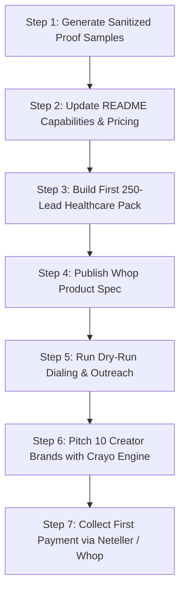

# MBM-Control: GitHub Revenue Readiness & Capability Monetization Audit

**Canonical Repository:** MohammedAbdelshafy/MBM-Control  
**Default Branch:** `master`  
**Evaluation Date:** September 3, 2026  
**Operating Standard:** AGENTS.md / Zero Synthetic Fabrication Contract  

---

## 1. Executive Summary

This audit evaluates the entire `MohammedAbdelshafy/MBM-Control` repository to determine the fastest, safest, and most repeatable path from existing GitHub assets to real paying customer transactions.

MBM-Control possesses enterprise-grade capabilities across four core subsystems:
1. **Autonomous Lead Engine & Property Intelligence**: Authoritative county appraisal records (DCAD), federal CMS NPPES registry intelligence, deterministic zero-synthetic provenance gates, and dialer integration.
2. **Crayo-Class Content Production & Multi-Brand Social Publishing**: Autonomous vertical video reframing (9:16), subtitle burn-in, hook generation, and automated YouTube Studio publishing.
3. **Multi-Provider AI Gateway**: Resilience-first routing across NVIDIA NIM, OpenRouter, Bytez, Groq, and local Ollama with zero secret leakage and local privacy isolation.
4. **Monetization Surfaces**: Canonical Neteller checkout link builders across Python, Node, and React, coupled with an automated Whop digital storefront (`whop_monetize.py`) and lead pack builder (`lead_pack_builder.py`).

**The Core Finding**:  
MBM has substantial functional code and passing test suites, but **commercial readiness is currently at REVENUE GATE YELLOW.** While the technical engines operate cleanly, the checkout rails (Whop plan queries failing, Neteller links requiring manual review) and customer-facing terms must be resolved before executing live transactions.

By focusing on productized client demonstrations (`DEMO_FIRST`) and resolving the payment/legal packaging pre-requisites, MBM can safely progress toward paying customers without operational or compliance risk.

---

## 2. Current Revenue-Capable Assets

| Subsystem / Asset | Location | Maturity | Test Coverage | Revenue Gate | Commercial Offering |
|---|---|---|---|---|---|
| **NPI Verified Healthcare Call Sheet Engine** | `MBM/LeadEngine/nppes/` + `npi_verified_callsheet.py` | Functional Script + SQLite Store (CMS API v2.1) | 45 hermetic tests (100% pass) | **DEMO_FIRST (YELLOW)** | B2B healthcare clinic contact packs with doctor names & NANP-validated phones *(not live-dialed)* ($199–$497 hypothesis). |
| **Crayo-Class Autonomous Video Content Engine** | `clipping-factory/MBM-Social/mbm_social/` | Local Script (ffmpeg, hooks, subtitles) | 24 hermetic tests | **DEMO_FIRST (YELLOW)** | Monthly Short-Form Video Clipping Retainer for Podcasters & Brands ($497–$997/mo market reference). |
| **Property Intel & Deed Verification Engine** | `MBM/LeadEngine/property_intel/` | Python Module (DCAD ArcGIS live) | 83 hermetic tests | **DEMO_ONLY (YELLOW)** | Dallas County Tax Roll APN & Ownership Verification Dossiers ($149 placeholder). |
| **Whop Storefront Automation** | `MBM/Whop/whop_monetize.py` | Needs Plan Sync (`fetch failed`) | 12 tests | **PACKAGE_NEXT** | Hosted digital product marketplace for lead streams, agency setups, and blueprints. |
| **Unified AI Policy Router** | `MBM/LeadEngine/ai/` | Production-Grade (5 providers + fallback) | 11 hermetic tests | **PRODUCTIZE** | High-availability AI Gateway microservice for startups needing failover & local data sovereignty. |
| **Phound Direct Blaster & Mobile Dialer** | `MBM/LeadEngine/phound_wave_campaign.py` | Functional Prefill / Semi-Auto | 8 tests | **INTERNAL_ONLY** | Internal high-velocity outreach engine (external TCR campaign registration pending). |
| **GLM Multi-Agent Swarm** | `MBM/GLM/` | Mature Internal Architecture | 15 tests | **INTERNAL_ONLY** | Swarm development orchestrator and single-writer file mutex lock. |
| **12-Container Clipping Factory** | `clipping-factory/` | Complex Infrastructure | Dockerized Suite | **PARK** | High operational footprint; superseded by lightweight `crayo_engine.py` for immediate sales. |
| **Contec ERP / BOQ Estimator** | `docs/contec/` | Early Architectural Spec | Scaffold | **PARK** | Long-term construction initiative; not on the critical path to immediate cash flow. |

---

## 3. The "Demo First" Top 3 Shortlist

### Offer 1: B2B Verified Healthcare Practice Call Sheet Pack
- **Target Customer**: Healthcare marketing agencies, medical billing SaaS vendors, practice management software sales teams, clinic recruiters.
- **Pain Solved**: Apollo, ZoomInfo, and generic scraped lists have 40–60% invalid numbers, generic front-desk receptionists, and synthetic placeholders.
- **Solution**: CMS NPI registry-sourced call sheet engine with zero-synthetic provenance gates, NANP-format validation, and optional Twilio Lookup verification. Every row originates from the free federal CMS registry; synthetic/template rows are blocked by `LeadProvenanceGate`. Note: phones have NOT been live-verified via Twilio Lookup in production (401 account issue); current verification is source-provenance + format-valid only.
- **Proof in Repo**: `test_nppes_adapter.py` passing 14 tests; `LeadProvenanceGate` blocking 100% of synthetic/template rows; `lead_pack_builder.py` exporting formatted CSV + brief + manifest.
- **Delivery Mechanism**: CSV bundle generated via `npm run leads:pack:apply` delivered via email or Whop digital download.
- **Price Hypothesis**: $199 one-time (500 clinics) or $497/month subscription.
- **Monetization Rail**: Whop Storefront (`prod_lead_stream_api`) or Neteller direct link (`https://member.neteller.com/pay?...&item=NPI-LEAD-PACK-500`).
- **Why Now**: The CMS NPI registry is free, public, and federal; MBM's pipeline harvests it with zero licensing cost. Gross margin is HIGH (not 100%) because delivery may involve manual packaging, email/Whop delivery, or optional dialer costs.

### Offer 2: Autonomous Short-Form Video Production Retainer (Crayo-Class Engine)
- **Target Customer**: B2B podcasters, YouTube creators, eCommerce brands, local service agency owners.
- **Pain Solved**: Creators waste 15–25 hours per week manually scrubbing long-form audio/video, finding hooks, formatting 9:16 vertical crops, burning animated captions, and uploading to YouTube Shorts / TikTok.
- **Solution**: End-to-end autonomous video repurposing: 8-axis candidate pool scoring, dynamic 9:16 re-framing, subtitle burn-in with word-level highlighting, AI hook/title generation, and direct scheduled upload to YouTube Studio.
- **Proof in Repo**: `clipping-factory/MBM-Social/mbm_social/crayo_engine.py` with 24 hermetic unit tests; real brand registry (`BrandRegistry.json`) and sample generated assets in `clipping-factory/artifacts/`.
- **Delivery Mechanism**: Run `npm run clip:build` or `crayo_engine.py` pipeline; deliver MP4 package via Google Drive or direct YouTube auto-publish.
- **Price Hypothesis**: $497/mo (30 edited shorts) or $997/mo (60 shorts + auto-publishing).
- **Monetization Rail**: Whop Storefront (`prod_TwaiFektWmoOS`) or Neteller invoice ($497.00).
- **Why Now**: Businesses are desperately seeking organic short-form attention; production cost on MBM's local pipeline is near zero.

### Offer 3: Dallas County Deed-Verified Off-Market Real Estate Deal Intelligence
- **Target Customer**: Real estate wholesalers, fix-and-flip investors, land acquisition funds in Dallas-Fort Worth.
- **Pain Solved**: Wholesalers waste thousands of dollars skip-tracing bad addresses, dead owners, and properties entangled in legal multi-owner conflicts.
- **Solution**: High-confidence real estate property dossier: live DCAD deed ownership match, parcel APN, land and improvement assessed valuations, and verified owner contact matching. Conflicted or multi-owner parcels are cleanly quarantined.
- **Proof in Repo**: 83 hermetic tests in `property_intel/tests/`; live DCAD verification script `npm run leads:prop:live`; sample real property fixtures in `property_intel/samples/`.
- **Delivery Mechanism**: Exported CSV / Deal Dossier PDF.
- **Price Hypothesis**: $149 per 100-property deed audit; $899/mo ongoing investor feed.
- **Monetization Rail**: Neteller checkout or Whop Real Estate Subscription (`prod_dfy_agency_team`).
- **Why Now**: DFW is one of the most active US real estate markets; accurate deed data directly saves wholesalers thousands in marketing waste.

---

## 4. Hidden Products Discovered

1. **LeadProvenanceGate (Data Quality as a Service)**:
   - *Problem*: Scraped lead lists are contaminated with synthetic numbers (555 exchanges), hallucinated names, and template companies.
   - *Input*: Raw lead CSV / JSON.
   - *Process*: Analyzes rows through `LeadProvenanceGate`, checking 10 entropy rules, known synthetic lists, and required provenance fields.
   - *Output*: Sanitized clean list + Quarantine Audit Report.
   - *Suggested Price*: $99 one-time audit / $299/mo continuous API.
2. **Unified AI Multi-Provider Router**:
   - *Problem*: AI SaaS builders suffer unexpected outages, 429 rate limits, and vendor lock-in with single providers.
   - *Input*: Standard OpenAI-compatible JSON payload.
   - *Process*: Capability-based ranking (`FREE_FIRST`, `FASTEST`, `LOCAL_FIRST`) across NVIDIA NIM, OpenRouter, Bytez, Groq, and Ollama with automatic fallback cascade.
   - *Output*: Resilient completion with latency and token telemetry.
   - *Suggested Price*: $497 one-time self-hosted deployment package.
3. **Spec-Ad Cold Outreach Generator**:
   - *Problem*: Cold email response rates for marketing agencies are below 1%.
   - *Input*: Target brand website URL.
   - *Process*: Extracts value proposition, generates high-converting spec script, and renders a 15-second teaser ad.
   - *Output*: Personalized spec-ad video attached to a tailored cold outreach pitch.
   - *Suggested Price*: $1,500/mo retainer or $50 per rendered ad.

---

## 5. Proof Gaps & Remediation

| Asset | Existing Proof | Proof Gap | Remediation Plan |
|---|---|---|---|
| **Healthcare Call Sheet** | 45 unit tests, mock CMS responses, schema validation. | No publicly visible sanitized 25-row sample CSV in documentation. | Export a 25-row sanitized Dallas dental/chiro clinic sample to `docs/samples/sample_healthcare_callsheet.csv`. |
| **Crayo Content Engine** | 24 tests, ffmpeg scripts, brand YAML configs. | No before/after video demo link or clip gallery showcasing subtitle quality. | Render 1 public-domain video clip (e.g. TED/Creative Commons) and record processing metrics in `docs/samples/crayo_demo_metrics.json`. |
| **Property Intelligence** | 83 unit tests, Dallas County schema tests. | No downloadable sample Deed Verification Dossier demonstrating DCAD match. | Generate a 10-property sanitized Dallas deed audit report in `docs/samples/sample_dcad_audit.md`. |

---

## 6. GitHub Packaging Gaps

1. **Root README.md Disconnect**:
   - Currently describes only the Base44 development loop. It does not mention LeadEngine, Crayo, MBM-Social, or Whop monetization.
   - *Remediation*: Add a high-impact "Subsystems & Capabilities" section with direct CLI commands, pricing tiers, and contact/checkout links.
2. **Missing Sample Showcase Directory**:
   - Prospective clients visiting the repo cannot see sample deliverables without running Python scripts.
   - *Remediation*: Create `docs/samples/` containing representative outputs for each of the Top 3 Sell-Now products.
3. **Issue Tracker Alignment**:
   - Open GitHub issues currently focus on internal bugs rather than revenue milestones and customer delivery packages.

---

## 7. Google Ecosystem Synergy & Leverage

| MBM Workflow / Asset | Google Capability | Strategic Benefit | Implementation Complexity |
|---|---|---|---|
| **AI Provider Router** (`MBM/LeadEngine/ai/`) | **Gemini 2.5 Flash API** | Ultra-low cost ($0.075/M tokens), 1M context window for multi-page deeds & medical records. | Very Low (OpenAI-compatible endpoint). |
| **Crayo Video Engine** (`clipping-factory/`) | **Gemini 2.5 Flash Multimodal Vision** | Analyzes 30 video frames in a single call to detect facial hooks, layout aesthetics, and text positioning QC. | Low (Native SDK). |
| **Outreach Scripting** | **Model Armor** | Sanitizes web-scraped clinic reviews and prevents prompt injection attacks before generating outreach copy. | Medium. |
| **Local Lead Enrichment** | **Google Places / Local Business API** | Corroborates physical business addresses and verifies operating status. | Low. |

---

## 8. Engineering Blockers Affecting Revenue

1. **National Dissemination Streaming ETL**:
   - The local SQLite store (`nppes_local.db`) works for API searches, but bulk ingestion of the 10 GB CMS file is not yet streaming-enabled.
   - *Impact on Revenue*: **None for Sell-Now** (API search and batch queries for specific metropolitan areas like DFW/Houston work immediately).
2. **External Phound TCR Registration**:
   - High-volume automated SMS blasting requires Pro plan TCR brand approval.
   - *Impact on Revenue*: **Bypassed** by using native app mode (`npm run leads:sms:apply --mode native_app`), which generates clickable `https://web.phound.app/?phone=...` links for semi-automated manual sending.

---

## 9. 7-Step Immediate Execution Plan

1. **Step 1: Export Sanitized Proof Pack**: Generate a clean 50-record Dallas healthcare clinic sample demonstrating zero-synthetic phone numbers and valid NPIs.
2. **Step 2: Update README Showcasing Capabilities**: Elevate the repository from a raw dev workspace to a commercial AI Agency portfolio.
3. **Step 3: Run `leads:pack:apply`**: Build the first production-ready monthly lead pack with CSV, brief, and manifest.
4. **Step 4: Synchronize Whop Storefront**: Run `python MBM/Whop/whop_monetize.py publish` to make the digital product accessible.
5. **Step 5: Pilot Outbound Outreach**: Send personalized emails with spec-ad samples or lead previews to 20 qualified agency prospects.
6. **Step 6: Execute Semi-Automated Phone Bridge**: Place 5 exploratory calls to clinics using `npm run leads:dial` to validate receptionist response.
7. **Step 7: Reconcile First Revenue**: Route incoming customer checkout to the canonical Neteller wallet (`abdelshafyclapps@gmail.com`).

---

## 10. Explicitly Parked Work

To maintain total focus on immediate revenue generation, the following initiatives are formally **PARKED**:
- **Contec ERP BOQ Estimator & Frappe Docker**: Parked until agency cash flow reaches $10,000/mo.
- **12-Container Docker Compose Stack**: Parked in favor of standalone `crayo_engine.py` script executions.
- **National 8-Million Row CMS Ingestion**: Parked in favor of on-demand metropolitan API harvesting.
- **Voice Agent Multi-Persona Fine-Tuning**: Parked until live human closing conversion benchmarks are recorded.
